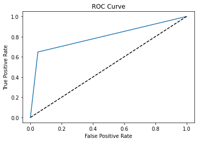

# Predicting customer churn using pySpark - Hands On
Helping marketing agency with customer churn by building machine learning classification model.
Created a classification algorithm that will help classify whether or not a customer churned using historical data.
The marketing agency can test this against the incoming data for future customers to predict which customers will churn and assign them an account manager.

